# Account management

1. You can access information about your Membes account at any time, click the **user icon** with your name in the top right.
2. Select the relevant option from the menu.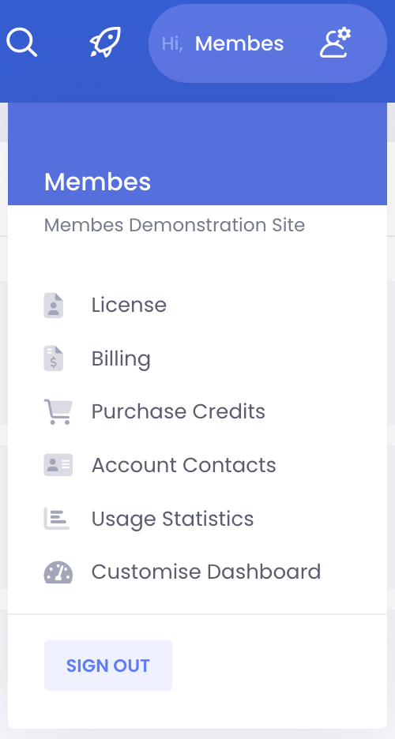

## Licence

1. ‌Select **Licence** to view information about your current Membes licence tier and which modules have been enabled.
2. Modules can be enabled/disabled by clicking the button on the screen.
3. Once you have enabled or disabled a module, log out of Admin and log back in for the change to activate.

## Billing

> Membes customers have the option to pay their monthly invoice via EFT or using a stored credit card. Customers who choose to store a credit card can enjoy the ‘set and forget’ convenience of automatic monthly invoice payments.
> 
> A notification is issued on the first business day of the month to let customers know their invoice is available to be viewed, and that the stored credit card will be debited within the next 48 hours.

> [!TIP]
> If you have any questions about your invoice you can submit a [billing enquiry form](https://resources.membes-ams.com/billing).

1. Select **Billing** to view your Membes invoices.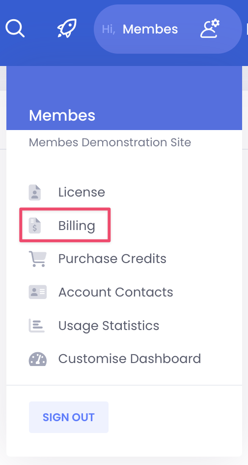
2. On the Billing screen you will see your list of invoices, unpaid invoices will be highlighted in red.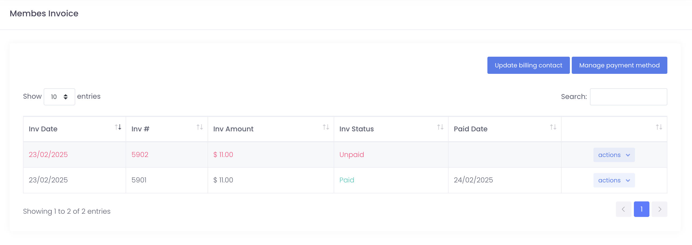
3. Click **Manage Payment Method** to select your preferred payment method.
4. Select your preferred payment method from the dropdown - **Pay on invoice** or **Auto payment with credit card**.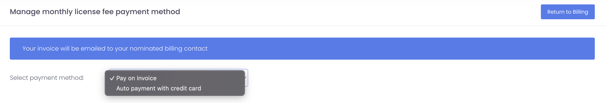
5. When you select **Auto payment with credit card** you will see a payment form, enter your credit card details and click **Save**.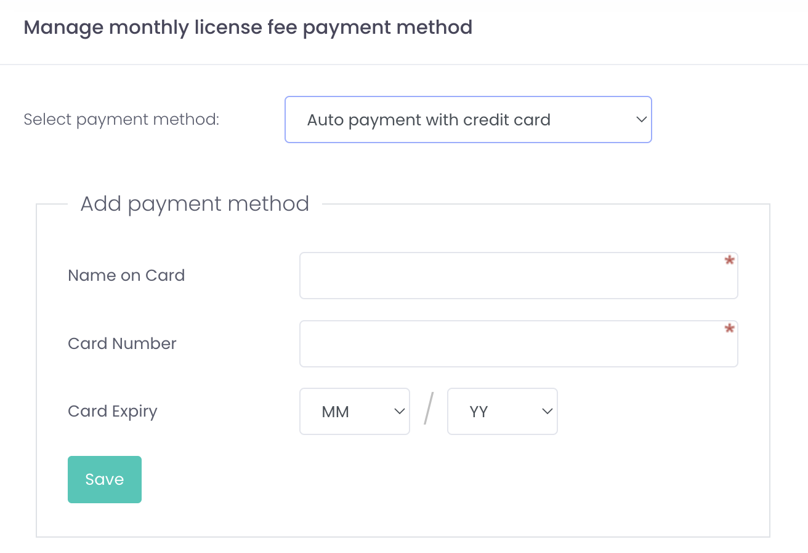
6. After you’ve updated your payment method click **Return to Billing** to be taken back to the invoice list.
7. To view or pay an invoice, click on the **Actions** button and select the relevant option.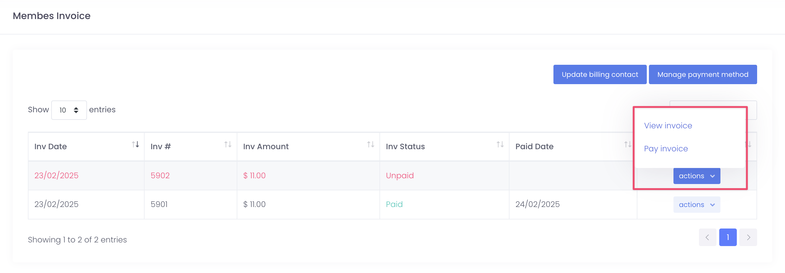
8. When you select **View Invoice** your invoice will display in a new tab or window.
9. Selecting **Pay Invoice** will take you to the payment screen where you can enter credit card details and complete the invoice payment. Click the **Return to Billing** button to go back to the list of invoices.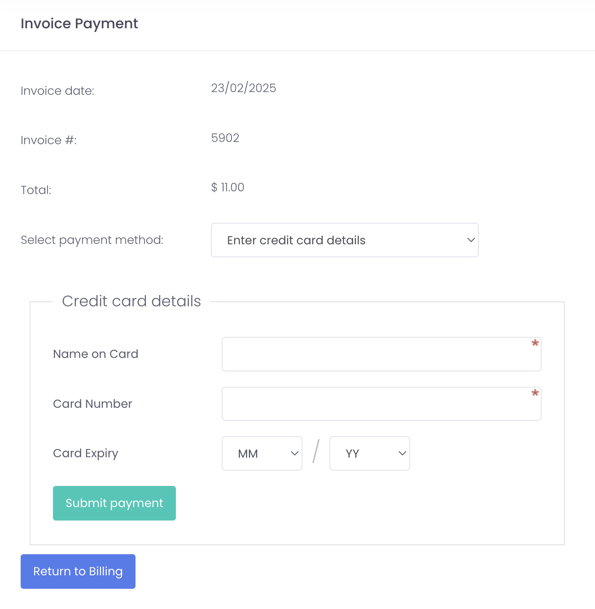
10. From the lit of invoices, click **Update Billing Contact** to change the email address your invoice is sent to.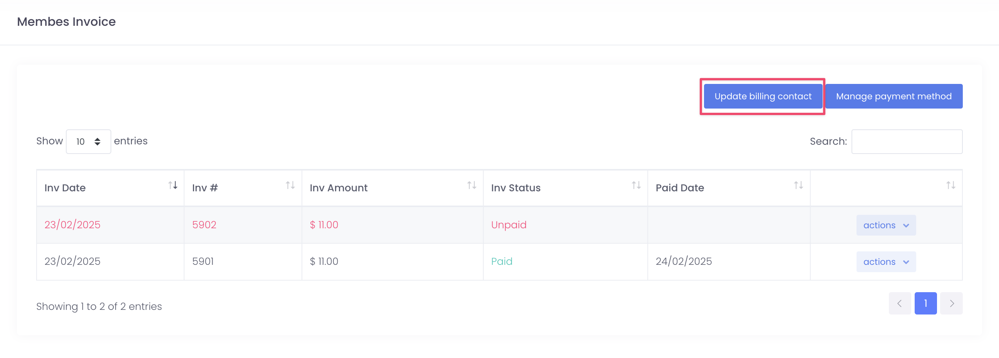
11. Enter the new email address into the Billing Contact field and click Save Contacts.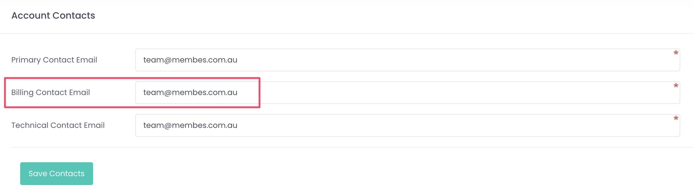

## Purchase credits

1. Select **Purchase Credits** to buy credits for some of the optional features such as Broadcast SMS.
2. Select your **Credit Type** and the **Number of Credits** you wish to purchase and click the **Purchase Credits** button.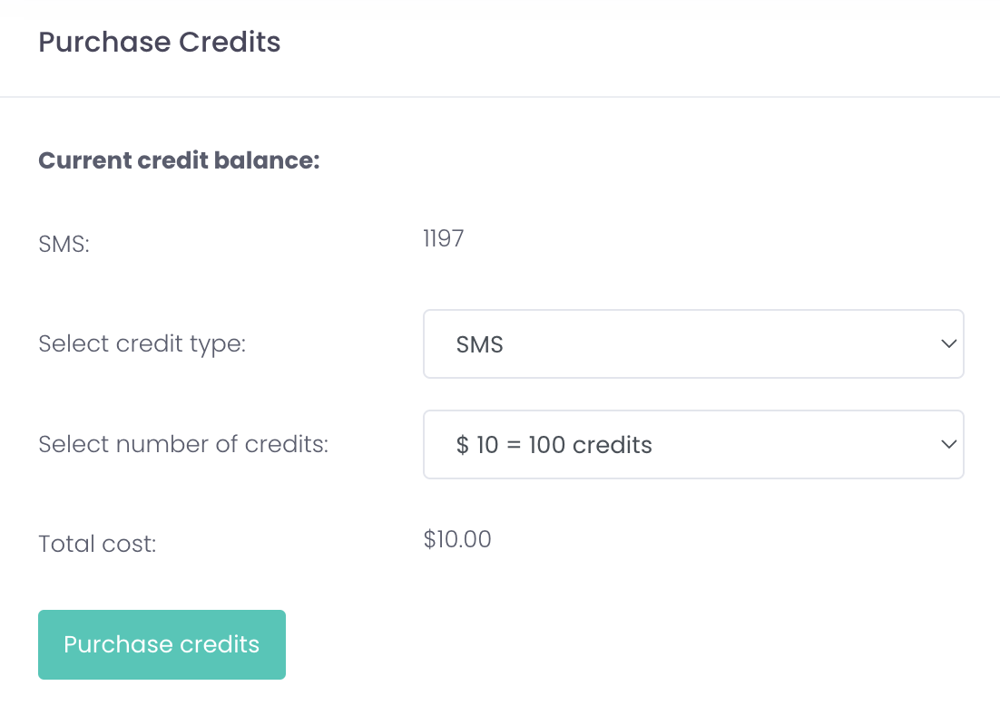
3. Click the **Select payment method** dropdown and choose **Enter credit card details** or **Use stored payment method** to complete your payment.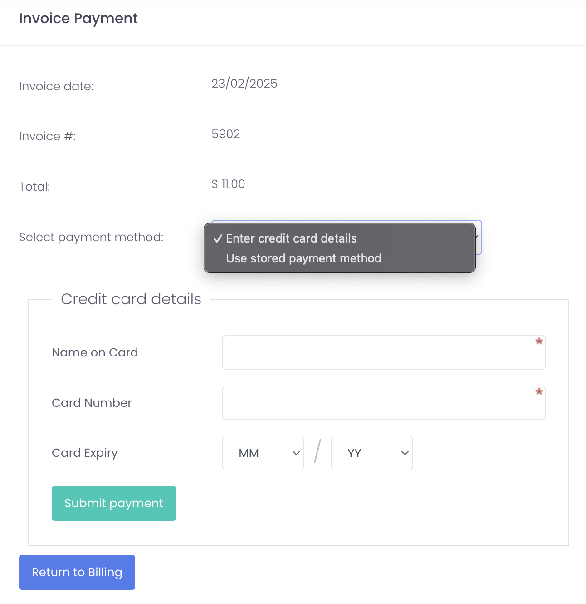

## Account contacts

1. Select **Account Contacts** to view your key business contacts.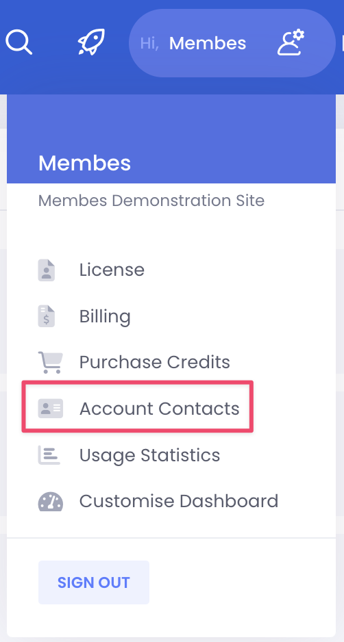
2. To update these, enter the new email address in the relevant address field and click **Save**.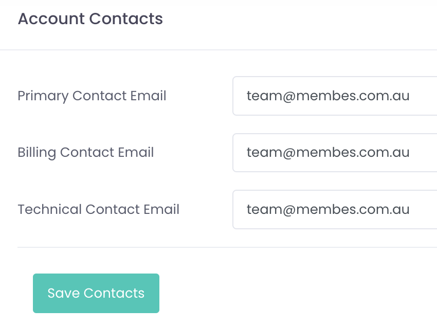

## Usage statistics

1. Select **Usage Statistics** to view some interesting information about your Membes AMS.

- [Licence](#licence)
- [Billing](#billing)
- [Purchase credits](#purchase-credits)
- [Account contacts](#account-contacts)
- [Usage statistics](#usage-statistics)