# Membes Support Hub

> Administrators have access to a range of support options to help make the most of your experience with Membes.
> 
> All user support is provided via the Help Desk, using specialist software. There are often multiple people involved so it is critical all support questions are logged in the Help Desk. This ensures all communication is centralised and can be viewed by the entire support team.

# How to access the Support Hub

1. Click on the **life buoy** icon located in the bottom left corner of the screen under the menu pane.  

2. You’ll be taken to the **Support Hub** screen where you will see several different options.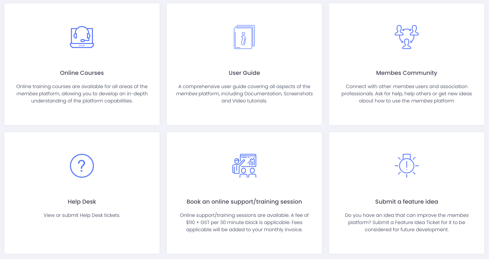

# Ask the Membes Assistant

Membes is leveraging the power of AI to provide better support to customers. The AI engine is trained using data from the User Guide and the questions and answers from previously logged Help Desk ticket.

1. To use the Membes Assistant, enter your question into the text area and click **Ask**.
2. An answer to your question will display under the **Ask** button.[Invalid%20file%20id%20-%2080a348cd-8498-4e59-8bc9-9dde6198b4a1](./attachments/Invalid%20file%20id%20-%2080a348cd-8498-4e59-8bc9-9dde6198b4a1)
3. If Membes Assistant answers with sufficient information, click the **Thanks, this answered my question** button.
4. If the answer isn’t clear or you need more information, click the **This didn’t answer my question** button and you will be given an option to submit a Help Desk ticket.

> [!TIP]
> The AI engine is constantly evolving, if you didn’t get the answer you were looking for, try changing the way you ask the question. Rephrasing your question or adding more detail can help return a better answer.

# How to submit a ticket

> [!CAUTION]
> **IMPORTANT:** Only users who have completed the online training can submit a ticket. If you haven’t completed the online training you will see a list of administrators who have Help Desk access and they can submit a ticket on your behalf.

1. Click **Submit a ticket**.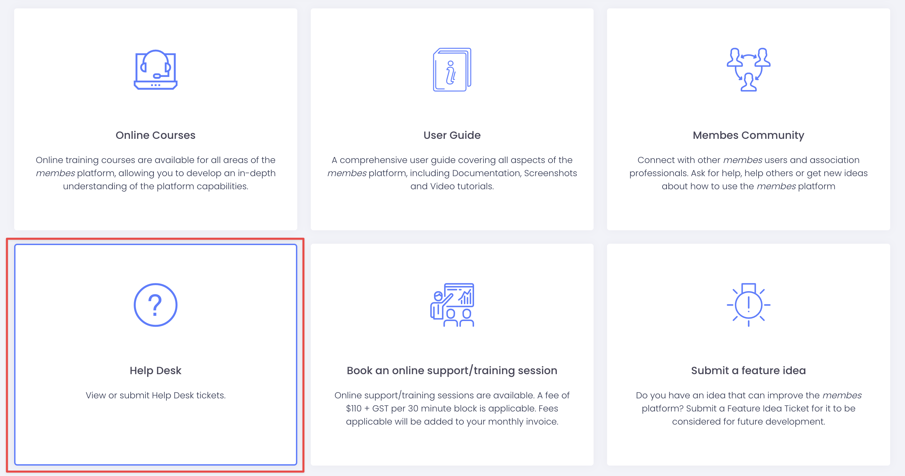
2. Click the New Ticket button.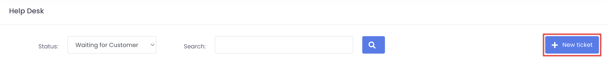
3. Complete the **New Ticket form**, taking care to include as much detail as possible then click the **Submit** button at the bottom of the screen. See the [**How to submit a good Help Desk ticket**](https://membes.atlassian.net/wiki/spaces/UG/pages/edit-v2/550141957#How-to-submit-a-good-Help-Desk-ticket) for more information.  
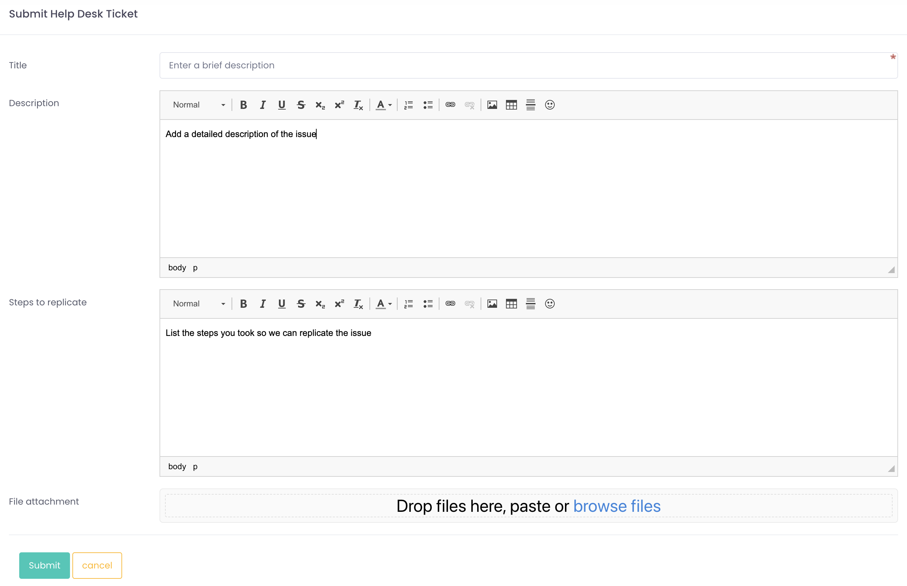
4. You will receive an email notification that your Help Desk ticket has been submitted.

## Replying to or closing a Help Desk ticket

1. When the support team responds to your ticket, you will receive an email notification. You can click the link in the email to view the ticket and the most recent comment.
2. Click the **Reply** button to pop open the editor and reply. Or if the ticket has been resolved, click the **Close Ticket** link.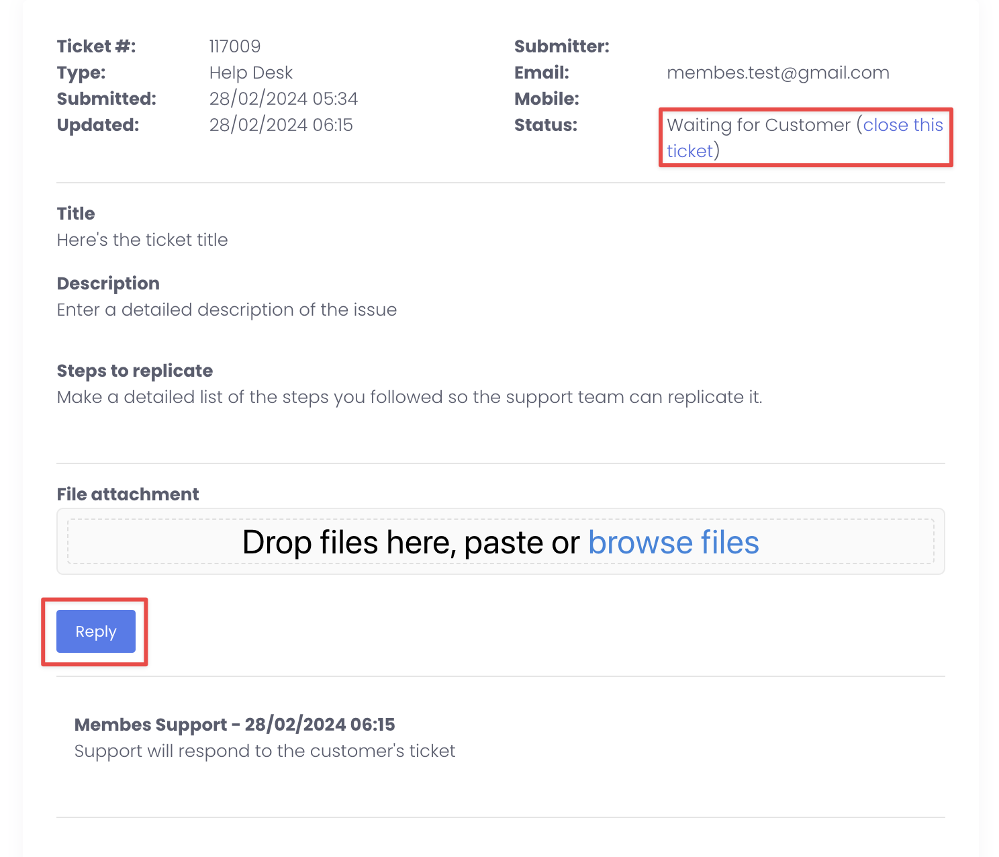
3. Add in your comment or upload any screenshots if needed and click the **Submit Reply** button.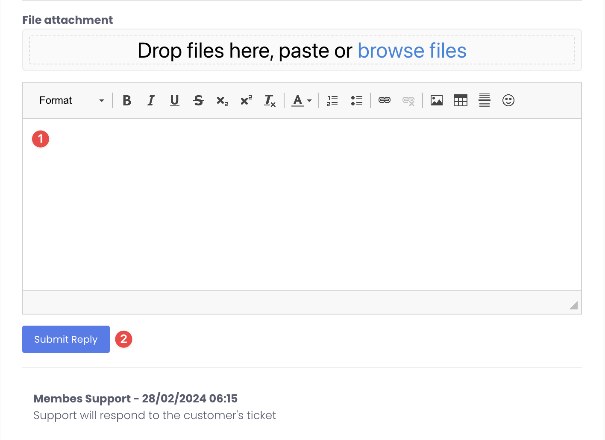

> [!TIP]
> Closed tickets can be reopened by adding a new comment.

## What to Do If You Don’t Have Access to the Help Desk

If you are unable to access the Membes Help Desk to submit a support ticket, follow these steps to ensure your issue is addressed efficiently.

1. **Attempt to Access the Help Desk**

- Ensure you are using the correct login credentials.
- If you forgot your password, use the ‘Forgot Password’ option to reset it.
- If login issues persist, contact your system administrator for assistance.

2. **Request Assistance from Your Team**

- If you need to submit a ticket but do not have Help Desk access, a member of your team who does have access must submit the request on your behalf.
- If no one on your team has Help Desk access, refer to Step 3.

3. **Contact Support Only for Urgent Technical Issues**

- The Help Desk is the primary channel for all communications. If you email [**support@membes.com.au**](mailto:support@membes.com.au) for a non-urgent issue, you will be directed to submit your request via the Help Desk.
- If the Help Desk is **technically inaccessible** and the issue is urgent, support may assist via email temporarily. However, ongoing support must be conducted through the Support Hub and Help Desk.

4. **If Your Team Lacks Help Desk Access**

- Arrange for at least one team member to complete the [Online training](https://membes.atlassian.net/wiki/x/FwAxLQ). This will give that team member access to the Help Desk.

By following these steps, you can ensure that your issue is addressed promptly while maintaining the appropriate support process.

## Viewing or searching for a ticket

Be default, when you open the Help Desk you will see the tickets that are awaiting your response. If you’d like to view tickets that are closed or waiting for a response from support you can filter the view by status and search.

1. Click the **Status** dropdown and select the ticket **Status** you’d like to view.  
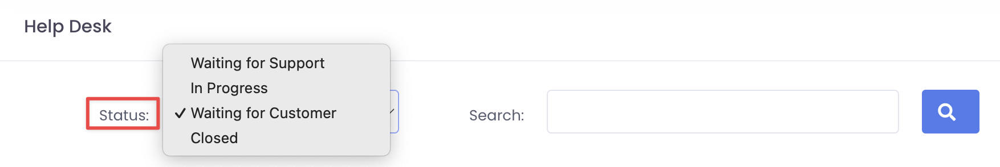
2. You can search tickets of that status by entering key words into the **Search** field and clicking the **Search button**.

# How to submit a good Help Desk ticket

When you submit a Help Desk ticket, it’s important to include as much information as possible. This helps to get your ticket resolved promptly as the support team don’t need to request additional information from you.

Include a clear summary or title of what the ticket is about. In the Description field add as much detail as you can, there’s no such thing as too much information! Include things like:

- Profile name or number
- Event name and/or date
- Relevant invoice numbers
- Screenshots
- Links to relevant pages on your website

It is important to include this information in the Description text field as well as any screenshots or attachments. When included in the Description field, the support team has a clear place to start their investigation.

Critical details are more difficult to find if buried in a screenshot or attached file and it’s easy to miss them, resulting in delays to your ticket getting resolved.

Help Desk tickets should also be limited to a single issue or question to avoid any confusion. When multiple things are listed in a ticket, it very quickly becomes difficult to see what has or hasn’t been answered.

## Steps to replicate

The first step to investigating any issue is to try and replicate it, this helps the support team to try and identify what might be causing it.

This is why the Steps to Replicate field is critical to resolving tickets as quickly as possible. Use this field to list the exact steps you followed, for example:

1. Created a new event
2. Added the event description details
3. When trying to upload the sponsor’s logo, the image isn’t appearing in the description box
4. I saved the event, but am only seeing a placeholder image on the website

## Ticket comments and updates

To help identify what may be causing an issue or why something isn’t working as expected sometimes the support team will comment on the ticket and ask questions or request more detail.

It’s important to provide the specific information requested to assist with investigations. Your ticket can be delayed if the team need to keep requesting the information they need.

# Online courses

Help Desk access is available to all users who have completed the online training.

Click Online Courses to be taken to the registration link and list of courses in the User Guide.

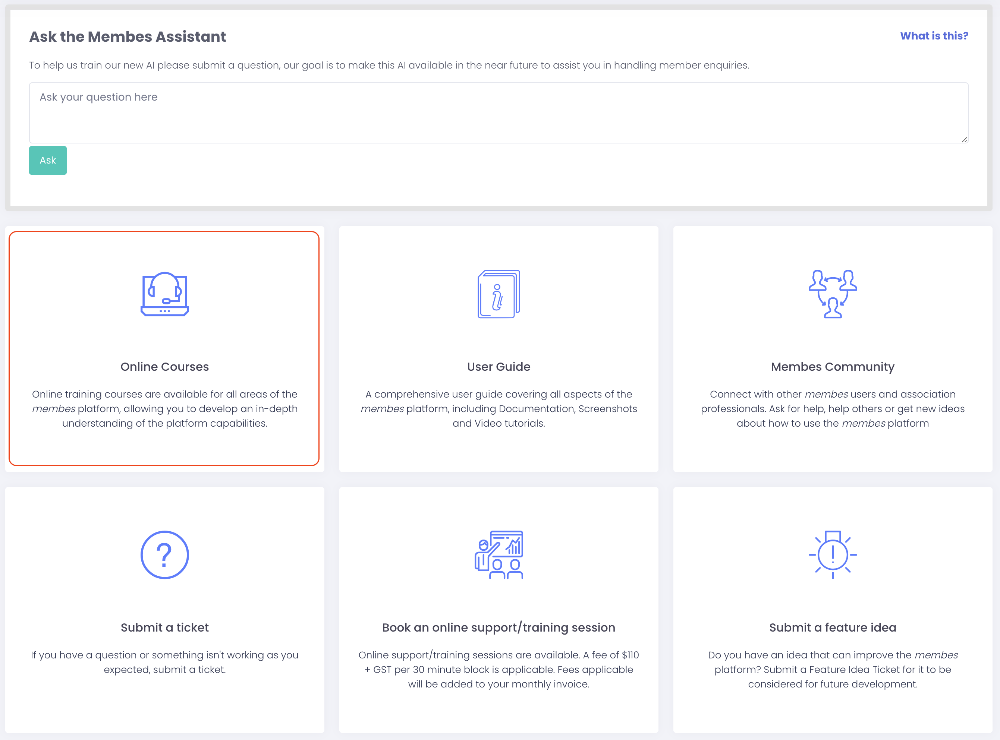

# Submitting a feature idea

If you have a suggestion or idea for improving Membes, you can submit a feature idea, and it will be taken into consideration when scoping out future development. The feature ideas can be voted on by the Membes Community.

1. Click **Submit a feature idea**.  
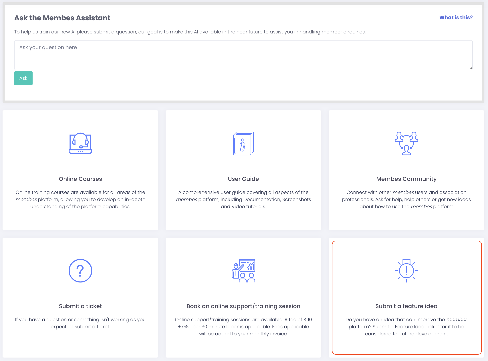
2. Click the ‘Add’ button
3. The feature idea form will open in a new tab or window.
4. Complete the form and click **Send**.  

> [!CAUTION]
> **IMPORTANT:** Only users who have completed the online training have access to submit a feature idea.

# Feature Ideas Process

The Feature Ideas board is the central place for Membes users to submit ideas and suggestions for future platform enhancements. It ensures the platform continues to evolve based on the real needs and experiences of associations using Membes.

**Review Process**

- **Weekly review**: The Membes team reviews the Feature Ideas board once a week to assess new ideas, updates to existing ideas, and community feedback.

**Steps taken by the Membes team after review**

1. **Initial assessment** – Ideas are reviewed for clarity, alignment with platform direction, and potential benefit to the wider Membes community.
2. **Status update** – Each idea is updated to reflect its current stage. Statuses used include:
  - **Gathering updates**
  - **Under Consideration**
  - **In Review**
  - **Approved for Development**
  - **In Progress**
  - **Future Consideration**
  - **Not Being Considered**
  - **Completed**
  - **Existing Functionality**
3. **Feasibility evaluation** – The technical team assesses feasibility, development time, and platform dependencies.
4. **Prioritisation** – Feasible ideas that align with strategic priorities are prioritised within the development roadmap, considering demand from multiple associations.
5. **Communication** – Users who submitted or voted on ideas are kept informed via the Feature Ideas board when statuses are updated or new release notes are published. Note: The monthly Newsletter will also announce any new releases

This structured process ensures all ideas are captured, reviewed, and transparently progressed to support ongoing improvements for the benefit of all Membes users.

# Membes Community

The Membes Community is a peer-to-peer platform where you can connect with other Association professionals to share experiences, discuss hot topics and ask questions.

Click Membes Community to be taken to the Community website.

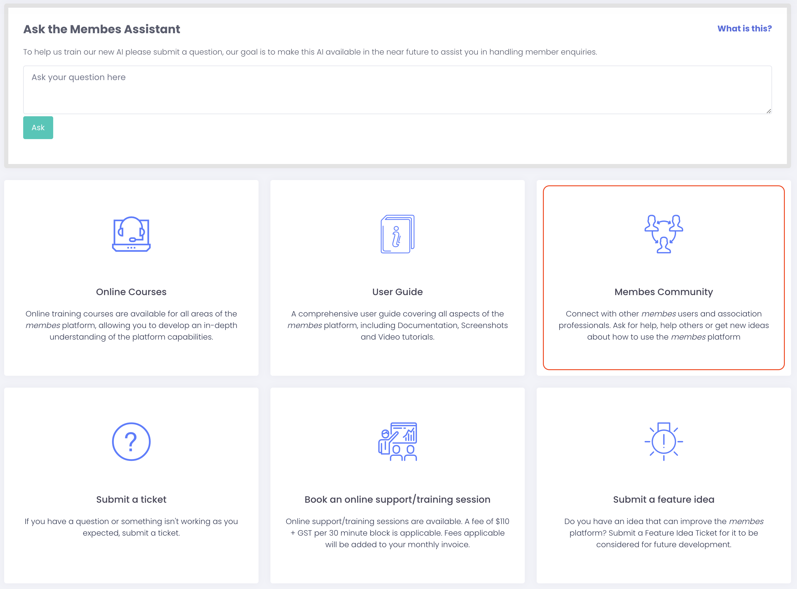

# Book an online training/support session

If you think you need additional help you can book an online training/support session with a member of the support team. These sessions are conducted via web conference.

When you click **Book an online support/training session** you’ll see an alert advising the fees will apply for online training/support sessions. The fees will be added to your monthly invoice.

The **Click here to schedule session** link will take you to a calendar to book a session at a time of your choosing.

**Please note:** Online training and support sessions booked through the Membes platform are **charged services** and will appear on your monthly invoice.  
However, if during a booked training session the issue raised is found to be a **verifiable system bug within the Membes AMS**, **no charges will apply for that session**.  
We recommend clearly outlining your questions or concerns when booking the session. If you suspect a system issue, please note it upfront to assist the support team in assessing the situation accurately.  Membes makes the final determination on whether or not an issue being experienced is being caused by a system bug within the Membes AMS or not.

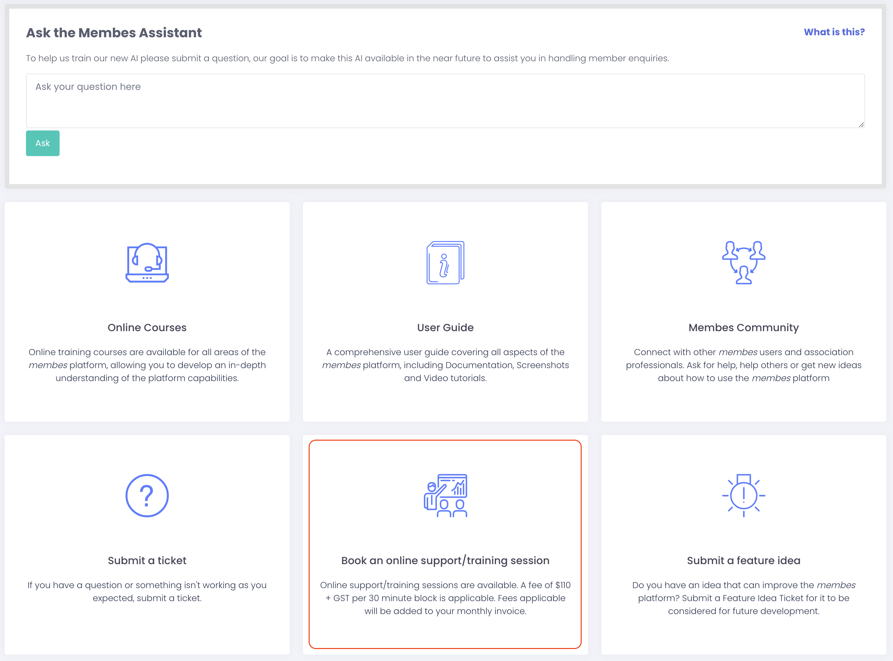

# User Guide

Click the **User Guide** link to open it in a new tab or window. It can also be accessed by clicking the **book icon** in the bottom left of the Admin screen.

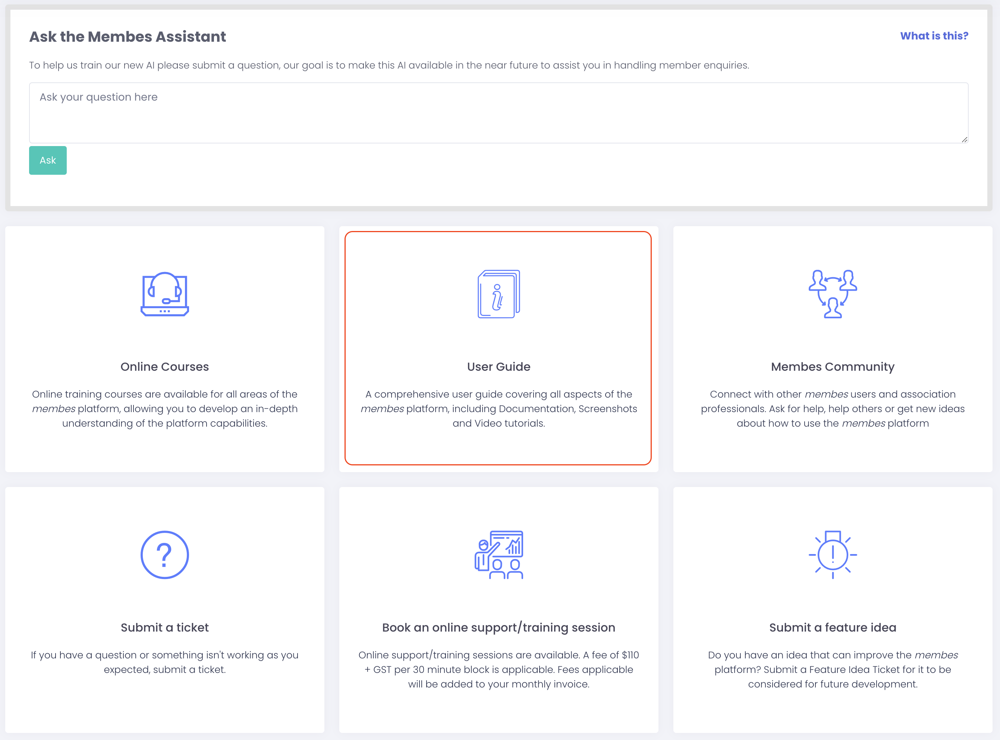

# Critical incident response

## **What to Expect**

At Membes, we understand how disruptive critical incidents can be. Our team is committed to resolving issues swiftly while keeping you informed every step of the way. Here’s a high-level overview of our process during a critical incident:

The teams priorities and focus during a critical incident are:

- Minimise any impact
- Progress towards an effective resolution as quickly as possible.

This is achieved through the following process.

### **1\. Incident Identification & Triage**

- We immediately acknowledge and assess the issue to determine severity and impact.
  - Critical incidents are prioritised, and the dedicated response team is activated.
  - All information is gathered in writing via the Membes Help Desk. This is to ensure no miscommunication, information is captured, tracked and centralised for availability in raw form to all responders and stages of the investigation.

### 2\. Investigation & Diagnosis

- Engineers investigate the root cause and work to contain the issue.
  - Possible actions at this stage: Provide regular updates via the Help Desk, including what we know, expected timelines or request clarifications to assist with resolution. The team manager overseeing the response may arrange an “off system” call with the reporter only if it is determined this may assist in progression to a resolution.

### 3\. Resolution & Testing

- Once cause of incident is identified, a fix will be developed and implemented as soon as possible.
  - On implementation of a resolution, rigorous testing is conducted to ensure the fix has had expected outcome before considered fully resolved.

### 4\. Communication of Investigation and Resolution

- The Support Team will provide regular updates to the customer via the Help Desk as new information becomes available throughout the investigation.
- When the incident is resolved, the Support Team will update the Help Desk ticket to confirm the resolution and any recommended follow-up steps if applicable.

### 5\. Post-Incident Review

Once resolved, the Membes team conduct a detailed internal review to identify the root cause and actions to prevent future occurrences.

## **How You Can Help**

Your patience and collaboration with the above process are key to a swift resolution. Providing as much detail reports as you can, including screenshots, examples etc in the initial notification will play a big part in the teams ability to diagnose and resolve any problems faster.

We appreciate your understanding during these critical moments and are committed to keeping your system running smoothly.

- [How to access the Support Hub](#how-to-access-the-support-hub)
- [Ask the Membes Assistant](#ask-the-membes-assistant)
- [How to submit a ticket](#how-to-submit-a-ticket)
  - [Replying to or closing a Help Desk ticket](#replying-to-or-closing-a-help-desk-ticket)
  - [What to Do If You Don’t Have Access to the Help Desk](#what-to-do-if-you-dont-have-access-to-the-help-desk)
  - [Viewing or searching for a ticket](#viewing-or-searching-for-a-ticket)
- [How to submit a good Help Desk ticket](#how-to-submit-a-good-help-desk-ticket)
  - [Steps to replicate](#steps-to-replicate)
  - [Ticket comments and updates](#ticket-comments-and-updates)
- [Online courses](#online-courses)
- [Submitting a feature idea](#submitting-a-feature-idea)
- [Feature Ideas Process](#feature-ideas-process)
- [Membes Community](#membes-community)
- [Book an online training/support session](#book-an-online-trainingsupport-session)
- [User Guide](#user-guide)
- [Critical incident response](#critical-incident-response)
  - [What to Expect](#what-to-expect)
  - [How You Can Help](#how-you-can-help)